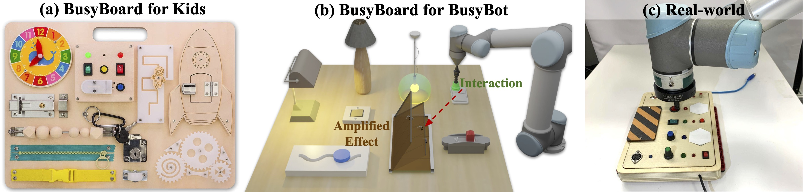

# BusyBot: Learning to Interact, Reason, and Plan in a BusyBoard Environment

<div style="text-align: center;">

[Zeyi Liu](https://lzylucy.github.io/), [Zhenjia Xu](https://www.zhenjiaxu.com/), [Shuran Song](https://www.cs.columbia.edu/~shurans/)

Columbia University, New York, NY, United States

[Conference on Robot Learning 2022](https://www.robot-learning.org/)

[Project Page](https://busybot.cs.columbia.edu/) | [Video](https://www.youtube.com/watch?v=EJ98xBJZ9ek) | [arXiv](https://arxiv.org/abs/2207.08192)

</div>



## Dependencies
We have prepared a conda YAML file which contains all the python dependencies.

```
conda env create -f environment.yml
```


## Data and Model
Download the pretrained interaction and reasoning model here, and place it under ```interact/pre-trained/``` and ```reason/pre-trained/```.

Download the interaction data for training the reasoning model here, and place the ```data/``` directory under ```reason/```. You can also generate your own interaction data by running the interaction module.

```interact/assets/objects/``` contains the URDF models for all objects. The Door, Lamp, and Switch category are selected from the PartNet-Mobility Dataset from [SAPIEN](https://sapien.ucsd.edu/). The Toy category are borrowed from [UMPNet](https://github.com/columbia-ai-robotics/umpnet). The ```interact/assets/objects/data.json``` file defines the train and test instances. Each object also corresponds to a ```object_meta_info.json``` file that contains basic object information: category, instance id, scale, moveable link, bounding box, cause/effect properties, etc. If you want to add new objects from the PartNet-Mobility Dataset, you can refer to ```interact/data_process.py``` on how to process the data.

## Interaction Module
To train the interaction module, run the following command
```sh
cd interact
python train.py --exp {exp_name}
```
You can access the trained models and visualization under ```interact/exp/{exp_name}```.

## Reasoning Module
To train the reasoning module, run the following command
```sh
cd reason
bash scripts/train_board.sh --exp {exp_name}
```
You can access the trained models under ```reason/model/{exp_name}```. 

For future state prediction, we evaluate the state accuracy of objects. To map object feature extracted from image to object state, we train a decoder for each object category and provide the pre-trained models under ```reason/decoders/```.

To run a demo of the trained reasoning model given a single interaction sequence, run the following command
```sh
cd reason
bash scripts/demo_board.sh
```

If you want to extract image features on your own interaction dataset, we provide a script to do that as well
```sh
cd reason
bash scripts/feature_extract.sh
```

## Planning Module
To run evaluation on goal-conditioned tasks, run the following command
```sh
cd plan
bash scripts/planning.sh
```

## Acknowledgement
We refer to [UMPNet](https://github.com/columbia-ai-robotics/umpnet) by Zhenjia Xu for the interaction module and [V-CDN](https://github.com/pairlab/v-cdn) by Yunzhu Li for the reasoning module when developing this codebase.

## Citation
If you find this codebase useful, consider citing:
<div style="display:flex;">
<div>

```
@inproceedings{liu2022busybot,
	title={BusyBot: Learning to Interact, Reason, and Plan in a BusyBoard Environment},
	author={Liu, Zeyi and Xu, Zhenjia and Song, Shuran},
	booktitle={Conference on Robot Learning (CoRL)},
	year={2022}
}
```